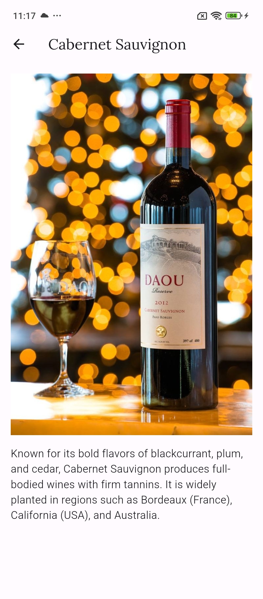

# Wine App

Welcome to the Wine App! This app is designed to provide information about various types of wines and their characteristics. Whether you're a wine enthusiast or just curious to learn more about different wine varieties, this app has something for everyone.

## Features

- **Browse Different Wine Types**: Explore a wide range of white, red, rosé, and sparkling wines.
- **Learn About Wine**: Discover key aspects of each wine type, including grape varieties, production processes, flavor profiles, and food pairing suggestions.
- **View Wine Details**: Dive deeper into specific wine types to learn more about their characteristics, including detailed descriptions and accompanying images.
- **Responsive Design**: The app is designed to work seamlessly across different devices, ensuring a consistent user experience.

## Screenshots

## Installation

To run the Wine App on your local machine, follow these steps:

1. Clone this repository to your local machine using `git clone`.
2. Navigate to the project directory.
3. Run `flutter pub get` to install dependencies.
4. Run the app using `flutter run`.

## Dependencies

The Wine App relies on the following dependencies:

- `flutter`: The Flutter SDK for building cross-platform apps.
- `get`: State management library for Flutter applications.

## Contributing

Contributions are welcome! If you have any suggestions, bug reports, or feature requests, please open an issue or submit a pull request.

## License

[Include your license information here]

## Acknowledgements

Special thanks to the following resources for inspiration and guidance:

[Add acknowledgements here]
